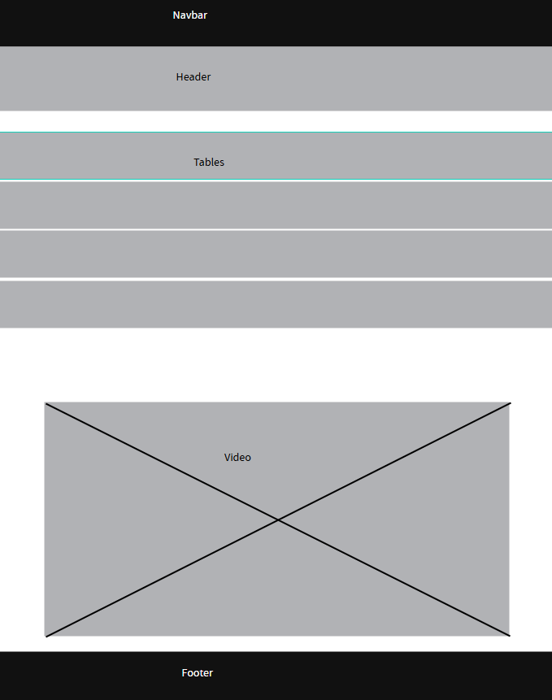
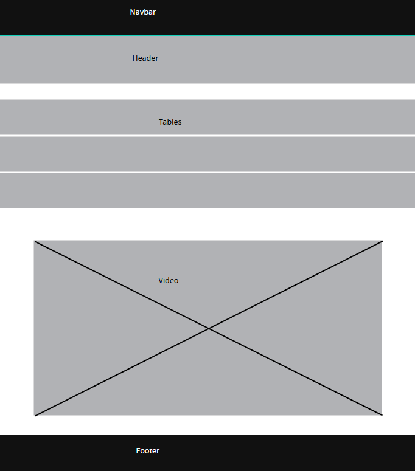
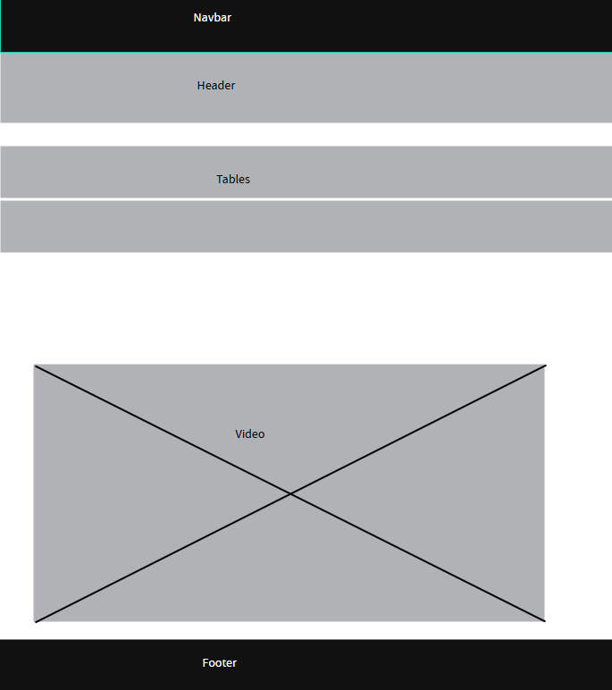
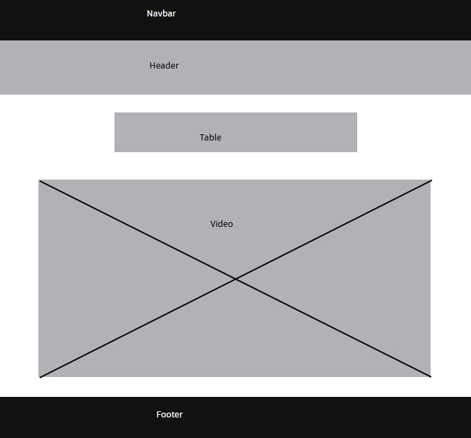
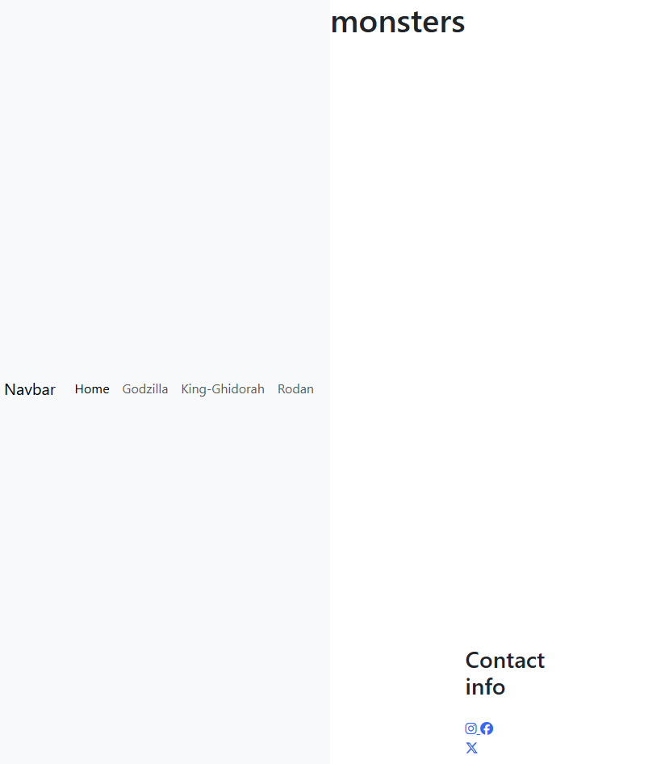
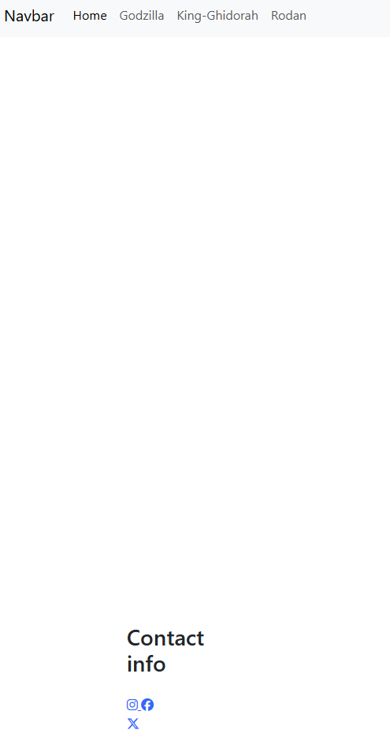
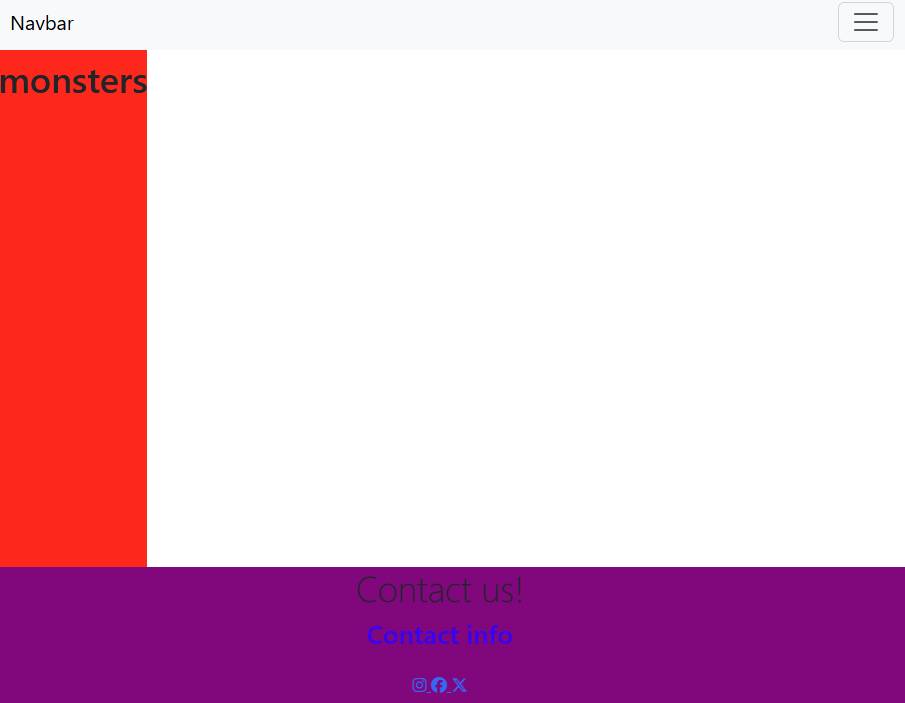
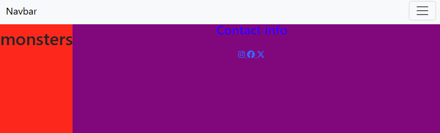
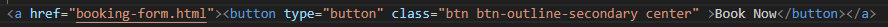

# project1 or records about monsters
# UX
# Project goals
## Viewer goals
The main target audience for this website is 12 to 18 year olds
Viewer goals are:
* Interresting monster videos to watch
* Have monster facts about how many 12 year old tall a monster is
* 
# Strategy Challenge
Opportunity/Problem|Importance|Viability/Feasibility|Total
---|---|---|---
Build a podcast|4|1|5
Build a brand|3|3|6
Search engine optimization|4|3|7
Build a art style|3|2|5
Public voting on how many people agree with something|4|1|5 
# Business goals
Promot your website and brand to sell products and host relevent adverts
Use meta tag and semantics to help with search engine optimization
Accessable with alt tags. The value the website owner gains is to 
sell monster related merchandice (t-shirts, pencils, notebook, rubbers, artwork nf films) 
call to action (request your order with a order number for each product on a order form)
# User needs
To get the information that they want
For the information to be clear
sign up
informed about new products
useful links 
Who are the users?
Children interrested in monster films
What are the Users' needs?
Links to websites about cinemas and age ratings
# User Stories
1. As parent with a child that is interested in monsters I want to know what age ratings
there are on monster films so that I can decide if I want to take my child to see a monster film
2. As a teacher that wants to start a film club I want to know how much a monster film cd costs
so I can decide what films I might put on in a film club
3. As a child who wants to watch monster films I want to go to a cinema website so
I can reserve my spot at a cinema to watch a film
4. As a monster film maker I want to know about the stats of different monsters so I
can promote my film and write accurate books
# These are my orignal acceptance criteria and tasks
# Acceptance criteria
1. The shop page displays a list of testimonials
2. The shop page displays a star rating
3. The testimonials section is reposnisve and looks good on multiple devices
# Tasks
1. write a html unordered list for the testimonials
2. Write some font awesome links to use star icons in the review star ratings
3. Use Bootstrap's grid system to make sure the testimonials section is responsive
# Later I put some different things on my github project like
# Acceptance criteria
1. User story 4 have a table of facts and fictional monsters
2. User story 3 A booking form for watching films
3. User story 2 The main page features a table with different prices
4. User story 1 The homepage features symbols for age ratings and what they mean
5. User story 1 A list of films that are available with the relevent age ratings
6. User story 1 Each official age rating symbol is matched with a monster at the stage of its life that represents the age of the people who are allowed to see it.
# Tasks
1. User story 4 Make a table of information about fictional monsters
2. User story 3 Make a form for booking films to watch
3. User story 3 Make a table using html tags to show different prices
4. User story 1 Integrate some age rating symbols using image tags to the website
5. User story 1 Make an unordered list of films next to symbols for there age rating
6. User story 1 Source some images of different aged monster to use with image tags
# Scope Challenge
Feature|Difficulty
---|---
main page|1
nav bar|2
iframes|2
background images|1
footer|1
form|3
tables|1
lists|1
## Product Rollout
### Release 1
iframes, background image and main pag. Release 1 total difficulty points 4
### Release 2 
footer and tables lists. Release 2 total difficulty points 3
### Release 3
form, nav bar. Release 3 total difficulty points 5
### Final Total
Product Release total difficulty points 12
# Structure Plane
## Wireframes made in penpot
* Apart from my home page which dosen't use boostrap grids all of my 3 other pages have the same wireframes
because they all have the same structure apart from which background image, text and video they have
they are the same
* Apart from my home page my other pages are responsive when you change the size of the screen the
tables stack on top of eachother using a boostrap grid system
* while using penpot I had the issue of exporting the wireframes I had made which didn't work very well
because I only seemed to be able to download one file even though there were 5 so I had to move each one to the top
of the list before exporting it. Later markdown was unable to show any of my PDFs so I used snipping tool to get the wireframe
images that I actually used in my readme file which the links to are below 
* 
* 
* 
* 
* 
### notes maybe add buttons that match the color scheme of a page when you hover over them and when you don't
# External sources
# From bootstrap
* [Bootstrap screen sizes for grid options](https://getbootstrap.com/docs/5.3/layout/breakpoints/)
* [Bootstrap buttons](https://getbootstrap.com/docs/5.3/components/buttons/)
# From Font Awesome
* [instagram icon from Font Awesome](https://fontawesome.com/icons/instagram?f=brands&s=solid)
* [facebook icon from Font Awesome](https://fontawesome.com/icons/facebook?f=brands&s=solid)
* [x icon from Font Awesome](https://fontawesome.com/icons/square-twitter?f=brands&s=solid)
# From youtube
* [NerdOut! musical video from youtube on Godzilla](https://www.youtube.com/watch?v=okMyRuVLVl0)
* [Aaron Fraser-Nash musical video from youtube on King Ghidorah](https://www.youtube.com/watch?v=S_mnlCuDljI)
* [Aaron Fraser-Nash musical video from youtube on Rodan](https://www.youtube.com/watch?v=mkoaxHTHzgg)
# From Wallpapers.com
* [Godzilla ocean image](https://wallpapers.com/wallpapers/godzilla-4k-ocean-j4mrrzqjy9vdfhxf.html)
* [Godzilla city image](https://wallpapers.com/wallpapers/godzilla-dominance-over-cityscape-igsni1rq48nf7yjv.html)
* [4 Titans image](https://wallpapers.com/wallpapers/rodan-znintsr46vlv41u1.html)
* [Rodan image](https://wallpapers.com/wallpapers/rodan-1280-x-882-mkjzoe6324kfao20.html)
* [king ghidorah](https://wallpapers.com/wallpapers/king-ghidorah-1500-x-904-wallpaper-3jelas62x68nb63n.html)
# From Pinterest
*[image of baby mothra and godzilla for age ratings](https://uk.pinterest.com/pin/818107088541699015/)
# From AI copilot
* [link to AI chatbot that I used for finding the hex code for the dark navbar theme so I could color match it with the footer](https://copilot.microsoft.com/)
*[link for AI chatbot for explaining how to do a transparent black background](https://www.bing.com/copilotsearch?q=how+do+you+set+a+id+in+css+to+transparent+black&form=CSBRAND)
*[link to AI chatbot for explaining how to change in the letters in a tag to uppercase](https://www.bing.com/copilotsearch?q=how+do+you+set+all+the+letter+in+a+tag+to+uppercase+css&form=CSBRAND)
# From freeCodeCamp
* [removing underline from link guide](https://www.freecodecamp.org/news/remove-underline-from-link-in-css/)
# From things I made up
* All the monster stats like Godzilla's stats are made up by me
* Times Films and prices are all made up by me
* The Awakening and the Vita are made up by me so are Diamond Muscles, Golden Bones and Molten Cores
# From stack overflow
*[how to center a iframe](https://stackoverflow.com/questions/8366957/how-to-center-an-iframe-horizontally)
# From w3schools
* [centering a table example from w3schools](https://www.w3schools.com/howto/howto_css_table_center.asp)
# From geeks for geeks website
* [how to have a button with a link wihtout having the button as a child of the a tag](https://www.geeksforgeeks.org/html/how-to-create-an-html-button-that-acts-like-a-link/)
# Testing
# problem 1
The navbar button wasn't working and when you click on it nothing happens the issue was I was missing a 
link from bootstrap that goes at the end of your code just before the closing body tag.
---

---
The issue here was the navbar appears on the side of the screen instead of the top to fix this I added the fixed-top class to the
nav tag
---

---
Here you can see the newer version with the navbar at the top
---

---
Orignally the red background was on top of the footer so it looked like part of the footer was missing
if I remember correctly I fixed this problem by adding the fixed-bottom class to the footer
---

---
This is a failed attempt to fix the same problem
---

---
This is a image of a fixed url that had ../assets at the start instead of ../images
---

---
For a while when I was trying to use an iframe to embed a youtube video I got an error 153
however when you look at the page from github as a deployed site the video/iframe works
---

---
Orginally when the header position was fixed it moved down with the navbar which I thought looked wrong
I also tried a postion relative but that brought back the problem with the footer so in the end I used
a position absolute which works
---

---
When I first made the table for age and height the columns were to close together so I
tested a style with extra width in the end I made a class called table-1 with set the width
to 150 solving the isssue so that the is enough distence between the columns so that you can read the text
---

---
This is what the table looked like after it had been styled
---

---
When I first did this class I forgot a few selectors like div tr
---

---
First I tired to import a button from boostrap
---

---
I needed a link from the book now button to the booking-form page but the a link made the text
on the button blue and highlighted
---

---
I tried making my own button but it took up the whole screen so I scraped it
---

---
I changed my button so that the button tag was inside an a tag instead of it being the other way around
this solved the issue of th whole button going white when you hovered over the very edge (when you hover over the
text the text goes black so you can still see it) thi might be because I had some styles for the a and button tag 
that were pretty much the same and the bootstrap was overwriting the button tag class but not the a tag so things only 
chnaged while you hover over the a tag which just has text

---
# html validator
These are the issues I got when I put my index.html page into html validator.

---
Here we have a tag I deleted like the validator suggested.
---

---
According to the html validator I should not have this frameborder attribute so I got rid of it.
---

---
I was missing a main closing tag so I added one in and it looks like this and after I put my page back into the validator it said
there were no errors.
---

---
These are the issues I got when I put my godzilla.html page into html validator.

---

---
Here there was a / for no apparent readon so I got rid of it.
---

---
Here the validator picked up that there was a p tag that was closed but never opened so I removed it
There was also a frameborder that got removed just like with the index.html page. After putting
the page back into the validator there were no more errors.
---
These are the issues I got when I put my king-ghidorah.html page into html validator

---
There was also a frameborder that got removed just like with the index.html page and also similarly a / that I removed I also add a closing
main tag. None of which I have images for king-ghidorah because I already have a image of all those issues for other pages. After putting
the page back into the validator there were no more errors.
---
These are the issues I got when I put my rodan.html page into html validator

---
All the issues with the rodan page were the same as the king-ghidorah page and now the validator says there are no errors.
---
These are the issues I got when I put my booking-form.html page into html validator

---

Here there was the issue with the random / which has now been removed. The other six issues are pretty much the same issue were I incorrectly used white space on a label id but 3 times for input tags and 3 times for label tags.
---
My success page had no errors when I put through the html validator
# css validator
The first time I put my css into the validator it said there were no errors so I don't have any issue fixing for it.
---
Deployment
explain that you delpoyed to github page
how to make a clone fork